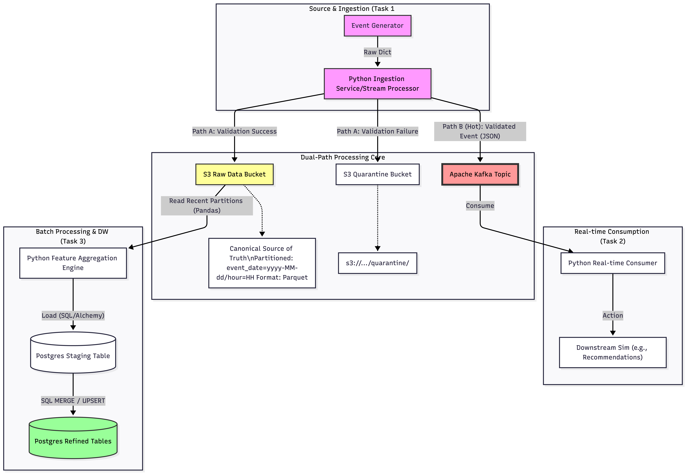

# event-pipeline

This project is a simple event pipeline that demonstrates how to generate events, publish them to a message broker and S3 bucket.
- Apache Kafka is used as the message broker. python & pandas is used for data manipulation and validation.
- PostgreSQL is used as data warehouse to store the events.
- Postgres table DDL scripts are provided in db_table_scripts directory.

## Setup instructions
1. Clone the repository:
   ```bash
   git clone https://github.com/sahin1627/event-pipeline.git
   cd event-pipeline
    ```
2. Install the required dependencies:
   python3.12 is used in this project, you can create a virtual environment and activate it. Then, run the following command to install the dependencies:
   ```bash
   pip install -r requirements.txt
   ```

3. Run docker-compose to start the services:
   ```bash
   docker-compose up -d
   ```
4. Run the event generator to start generating events:
   ```bash
   python event_generator.py
   ```

5. Run kafka consumer to consume events from the Kafka topic:
   ```bash
   python kafka_consumer.py
   ```

How Kafka should be consumed:
- The Kafka consumer will consume events from the `product-events` topic. 
- In order to consume the events, you can use the `kafka_consumer.py` script provided in the repository. This script will connect to the Kafka broker, subscribe to the `product-events` topic as an example.
- Data is validated before being published to the topic.

Short explanation of scaling considerations (10M events per day):
- To handle a high volume of events, we can scale the Kafka cluster horizontally by adding more brokers. This will allow us to distribute the load across multiple brokers and increase the overall throughput of the system.
- We can also partition the Kafka topic to allow for parallel processing of events. This will enable multiple consumers to consume events from the same topic simultaneously, further increasing the throughput of the system.
- To ensure data durability and reliability, we can configure Kafka to replicate the data across multiple brokers. This will help to prevent data loss in case of broker failures.

## Architecture diagram

